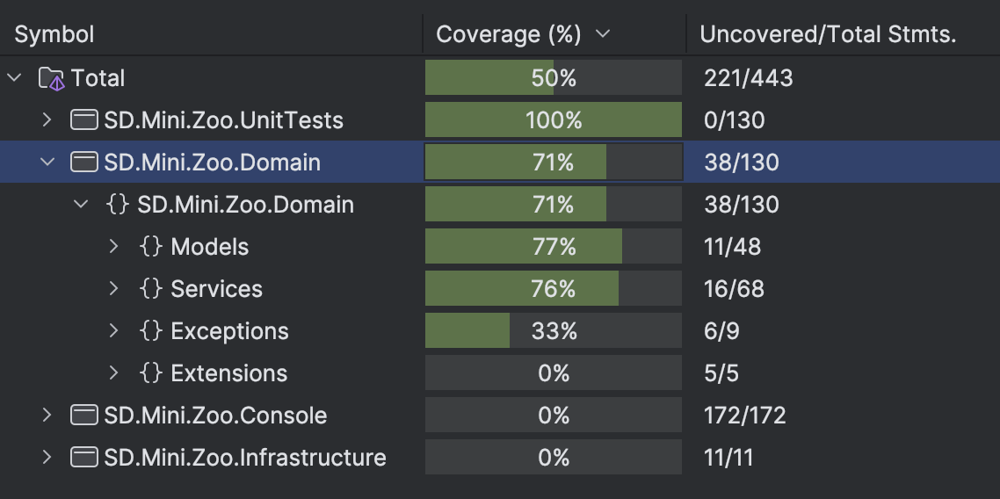

## Software Design, Mini Hw || HSE-SE 2 course

**Демченко Георгий Павлович, БПИ-235**

### Idea of solution

**Imitation of ASP.NET Web API workflow with Clean Architecture design.**

Console actions - request, everything else like in average Web API.

### Boot guidance

```bash
cd src/SD.Mini.Zoo.Console && dotnet run
```

### SOLID usage

| **Principle** | **Example of usage**                                                                                                                                                                                                                                     |
|---------------|----------------------------------------------------------------------------------------------------------------------------------------------------------------------------------------------------------------------------------------------------------|
| **S**         | Separation of program workflow to weakly bound components e.g <br> Console Action --> Controller --> Service --> Repository <br> Separation of services by domain zones, e.g ZooKeeperService (model management) and AnimalVetService (model validation) |
| **O**         | Models extends base classes, not making one Animal type which combines everything.g <br> Animal <- [Herbivore, Predator] <- Specific models e.g Wolf <br>                                                                                                |
| **L**         | Animal <- [Herbivore, Predator] <- Specific models e.g Wolf. <br> All services work with abstract type Animal in their declaration but in reality they work with specific models / subtypes of Animal                                                    |
| **I**         | Segregation of services, models, repositories interfaces <br> e.g IZooKeeperService and IAnimalVetService, IAlive and IInventory                                                                                                                         |
| **D**         | Controller depend on services interfaces, such as services depend on repositories interfaces e.g <br> ZooKeeperController -> IZooKeeperService -> IAnimalsRepository                                                                                     |


## Unit tests coverage rate

